# [Tansoftware](https://www.tansoftware.com) - Bonnes pratiques Git 

# Table des matières
* [Introduction](#introduction)
* [Nommage des commits](#nommage-des-commits)
* [Branching](#branching)
* [Gestion des conflits](#gestion-des-conflits)
* [Rebase vs Merge](#rebase-vs-merge)
* [Gestion des tags](#gestion-des-tags)
* [Squash](#squash)
* [Gestion des fichiers sensibles](#gestion-des-fichiers-sensibles)
* [Utilisation de Gitignore](#utilisation-de-gitignore)
* [Documentation de code](#documentation-de-code)
* [Utilisation de hooks Git](#utilisation-de-hooks-git)

## Introduction

Ce dépôt aborde les bonnes pratiques pour la gestion de versions et le contrôle de la qualité du code dans le cadre de Git.

## Nommage des commits
Un commit est un enregistrement d'une modification dans un système de [contrôle de version](https://fr.wikipedia.org/wiki/Gestion_de_versions) tel que Git. 
Cela permet de suivre l'historique des modifications apportées au code, de revenir en arrière en cas de problème et de collaborer efficacement avec d'autres développeurs.

Les messages de commit clairs et précis sont une partie importante de la gestion des versions de code. 

### Bonnes pratiques

-   **Utiliser des verbes d'action** - Utilisez des verbes d'action pour indiquer ce que fait le commit. Par exemple, utilisez "ajouter" pour ajouter une nouvelle fonctionnalité ou "corriger" pour corriger un bug.
    
-   **Être concis** - Essayez de résumer votre commit en 50 caractères ou moins pour faciliter la lecture de l'historique des commits.
    
-   **Être cohérent** - Utilisez un format de nommage cohérent pour tous vos commits. Par exemple, vous pouvez utiliser la forme "Ajouter: fonctionnalité X" pour tous vos commits qui ajoutent de nouvelles fonctionnalités.
   
### Nommage
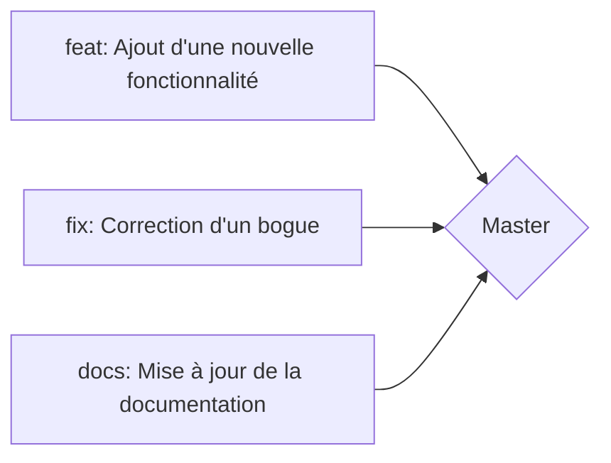
### Scenario
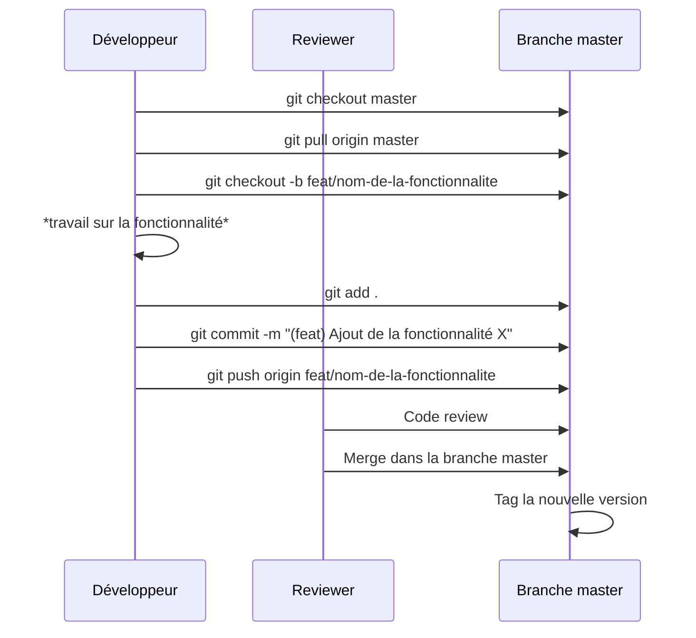
[🔝 Retour en haut de page](#table-des-matières)

## Branching
Le branching en Git permet de travailler simultanément sur plusieurs versions de code. Cette fonctionnalité est essentielle pour le développement en équipe, car elle permet à plusieurs développeurs de travailler sur le même projet sans interférer les uns avec les autres.

### Nommage des branches
Pour faciliter la gestion des branches, il est important d'adopter une convention de nommage claire et cohérente. Il est communément recommandé de nommer les branches en utilisant des préfixes tels que :
* "feat/" pour les nouvelles fonctionnalités, 
* "bug/" pour les corrections de bogues, 
* "hotfix/" pour les corrections de bugs critiques en production, 
* "release/" pour les versions de production, etc.
### Scénario
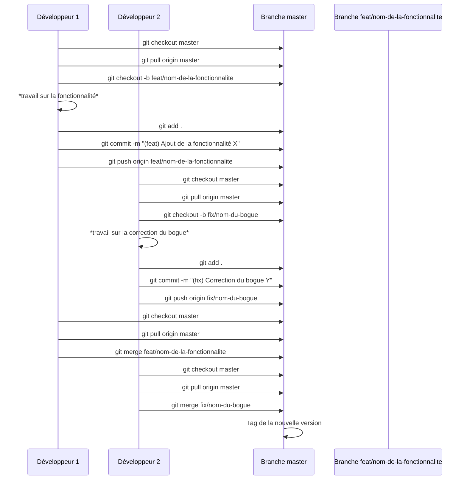
[🔝 Retour en haut de page](#table-des-matières)

## Gestion des conflits
Lorsque plusieurs développeurs travaillent sur un même projet, il peut arriver que des conflits surgissent lors de la fusion de deux branches. 
La fusion, est l'opération permettant de combiner les modifications apportées à deux branches différentes.

La gestion de ces conflits est une partie importante du processus de développement avec Git.

### Scénario
Deux développeurs travaillent sur une même fonctionnalité dans leur propre branche. 
Lorsqu'ils fusionnent leur travail, une erreur de merge se produit en raison de conflits entre les deux versions. 
Le développeur 2 doit alors résoudre le conflit manuellement en éditant le code et en le fusionnant de manière appropriée. 
Une fois le conflit résolu, le développeur 2 peut commiter les modifications et pousser la branche vers le serveur. 

Le processus de tag de la nouvelle version peut alors avoir lieu.
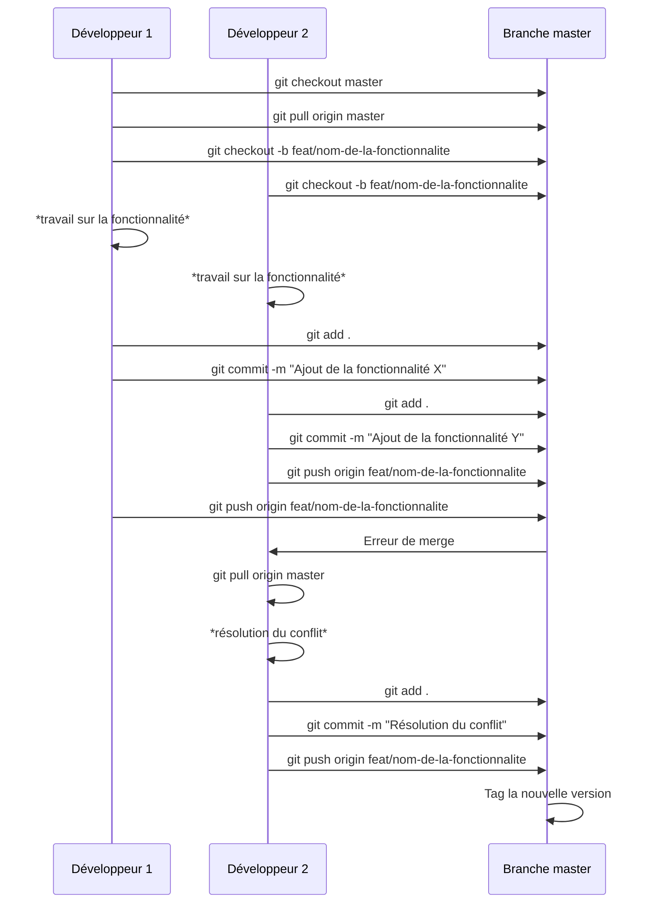
[🔝 Retour en haut de page](#table-des-matières)

## Rebase vs Merge
Lorsqu'il s'agit de fusionner une branche avec la branche principale (exemple develop dans master), il y a deux options : 
- le rebasage (rebase) 
- la fusion (merge). 

Bien que les deux méthodes atteignent le même objectif, elles ont tout de même quelques différences significatives dans la manière de le faire.
 
### Rebase
La méthode du rebasage consiste à prendre toutes les modifications apportées à une branche et à les replacer sur une autre branche. 
Cela signifie que l'historique de la branche originale est remplacé par celui de la branche de destination. 

Le résultat est une branche linéaire avec une histoire de commit claire et facile à suivre.

### Merge
La méthode de la fusion consiste à créer un nouveau commit qui combine les modifications apportées à deux branches. 
L'historique de chaque branche est conservé et la nouvelle branche résultante contient un commit de fusion qui représente l'union des deux branches.

### Scénario
Ce diagramme montre deux méthodes différentes pour gérer les conflits lors de la fusion de deux branches :

-   Avec le merge, les modifications des deux branches sont fusionnées dans une nouvelle branche.
-   Avec le rebase, les modifications de la branche actuelle sont replacées sur la tête de la branche cible, créant ainsi une nouvelle histoire linéaire.

Le choix entre ces deux méthodes dépend du contexte et de la complexité du projet. Le rebase est souvent préféré pour les projets qui ont une histoire complexe ou qui ont de nombreuses branches.
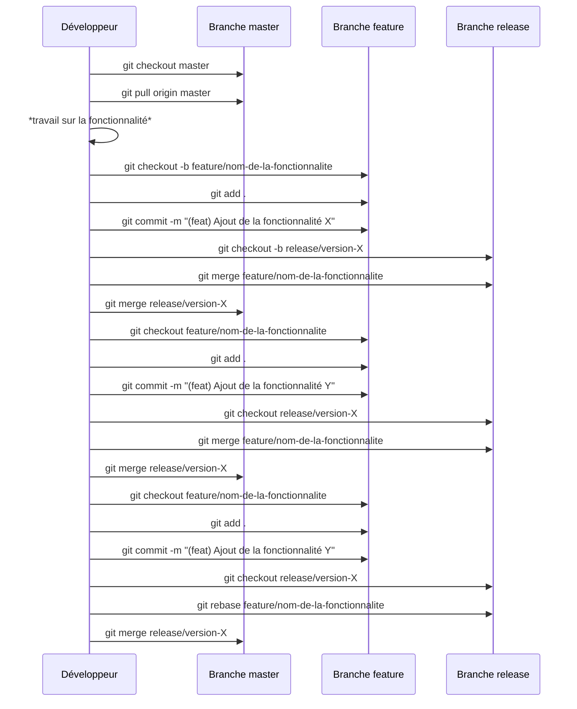
[🔝 Retour en haut de page](#table-des-matières)

## Gestion des tags
La gestion des tags est un élément important du processus de versioning d'un projet. Les tags permettent de marquer une version particulière de votre code source pour une utilisation ultérieure, telles que des versions stables ou des versions de maintenance.

### flot
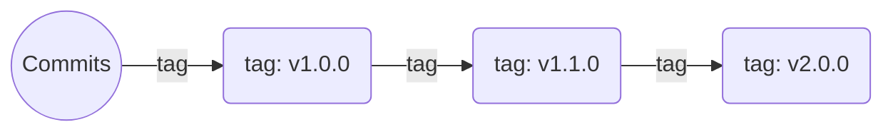
[🔝 Retour en haut de page](#table-des-matières)

## Squash
Le squash est une pratique qui consiste à fusionner plusieurs commits en un seul, plus clair et plus significatif. Cela permet de simplifier l'historique de développement et de faciliter la lecture et la compréhension du code.

### Scénario
Dans cet exemple, le développeur a effectué trois commits distincts pour la mise en place d'une fonctionnalité. Le reviewer effectue une code review et décide de fusionner les trois commits en un seul avant de fusionner la branche de développement avec la branche principale (master). Cela permet de simplifier l'historique de développement et de faciliter la lecture et la compréhension du code.
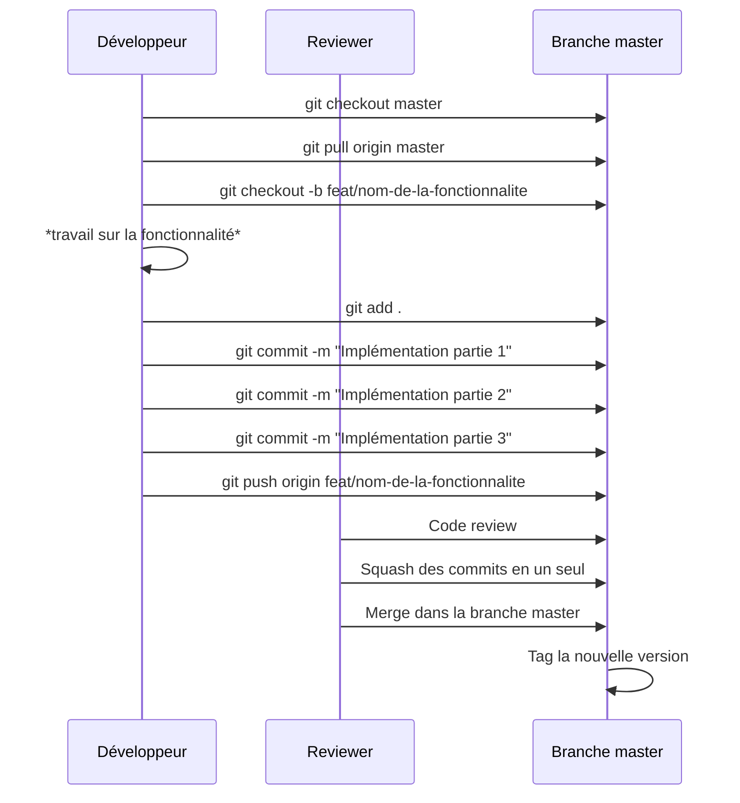
[🔝 Retour en haut de page](#table-des-matières)

## Gestion des fichiers sensibles

Les fichiers sensibles tels que les informations d'identification, les clés d'API ou les configurations de base de données doivent être gérés de manière à ne pas être exposés publiquement. Il est important de les exclure du suivi de version et de les stocker dans un endroit sécurisé tel que les variables d'environnement.

### Scénario
Un fichier sensible a été ajouté à un dépôt Git par un développeur. Le reviewer effectue une revue de code et décide d'exclure le fichier du dépôt en créant une règle dans le fichier Gitignore. 

Le développeur est également invité à stocker le fichier dans un endroit sécurisé, tel qu'un gestionnaire de mots de passe ou un service de stockage de fichiers cryptés. De plus, les variables d'environnement sont utilisées pour stocker les informations sensibles nécessaires à l'exécution du code sans les exposer publiquement. Cette pratique permet de protéger les informations sensibles et de renforcer la sécurité de l'application.

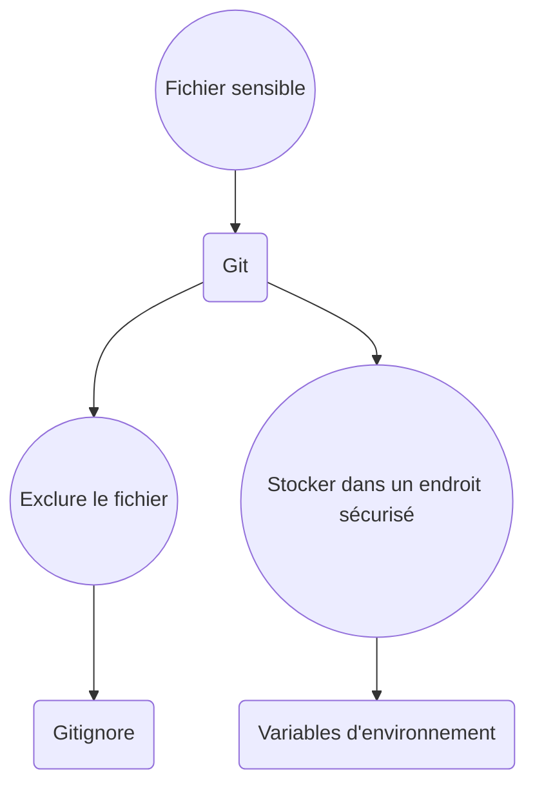
[🔝 Retour en haut de page](#table-des-matières)

## Utilisation de Gitignore

Le fichier Gitignore est un fichier dans lequel on spécifie les fichiers et dossiers qui doivent être ignorés par Git lors des opérations de commit, push, pull, etc. Il est souvent utilisé pour exclure les fichiers binaires, les fichiers générés automatiquement, les fichiers de configuration locaux, etc.

### Exemple 

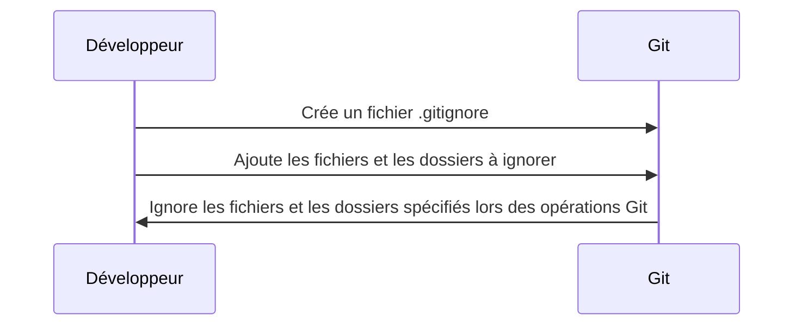
[🔝 Retour en haut de page](#table-des-matières)

## Documentation de code

La documentation de code est une pratique importante pour faciliter la compréhension et la maintenance du code par les développeurs. Elle peut prendre différentes formes, telles que des commentaires dans le code, des fichiers de documentation séparés, des annotations, des diagrammes, etc. Cette pratique permet aux nouveaux arrivants de mieux comprendre rapidement le code existant et facilite la maintenance future en clarifiant les intentions derrière le code.

### Scénario
Dans ce scénario, le développeur écrit du code et demande une revue de documentation à un documentateur. Le documentateur examine le code et rédige la documentation en conséquence. Le documentateur soumet ensuite la documentation à un examinateur pour vérification. Une fois la documentation approuvée, le développeur peut intégrer le code et la documentation dans le référentiel.

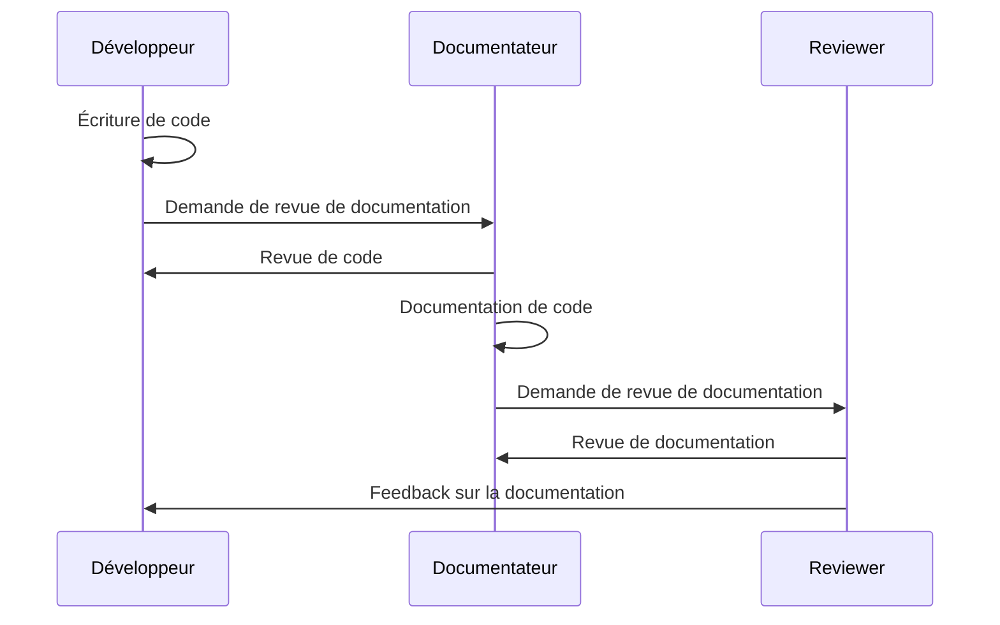
[🔝 Retour en haut de page](#table-des-matières)

## Utilisation de hooks Git

Les hooks Git sont des scripts qui s'exécutent automatiquement en réponse à certains événements, tels que la création d'un commit ou le push d'un changement. Les hooks peuvent être utilisés pour effectuer des tâches telles que la vérification de la qualité du code, l'exécution de tests automatisés ou l'envoi d'une notification lorsque des modifications sont effectuées.

Les hooks Git sont stockés dans le répertoire `.git/hooks` de votre dépôt local et sont exécutés localement sur votre machine. Il existe différents types de hooks Git, tels que les hooks de préparation (`pre-commit`, `pre-push`, etc.) et les hooks de réception (`post-commit`, `post-push`, etc.). Les hooks peuvent être écrits en utilisant n'importe quel langage de script, tels que Bash, Python ou Ruby.

L'utilisation de hooks Git peut grandement améliorer la qualité de votre code en automatisant des tâches importantes telles que la vérification de la qualité du code et l'exécution de tests automatisés. Voici un exemple de diagramme montrant comment utiliser les hooks Git pour exécuter des tests automatisés avant chaque commit :

### Scénario
Dans ce scénario, les tests automatisés sont exécutés avant chaque commit. Si les tests échouent, le développeur est notifié et les modifications ne sont pas envoyées. Si les tests réussissent, les modifications sont automatiquement validées. Cela garantit que seules des modifications de qualité sont ajoutées au dépôt et réduit les risques de régression.

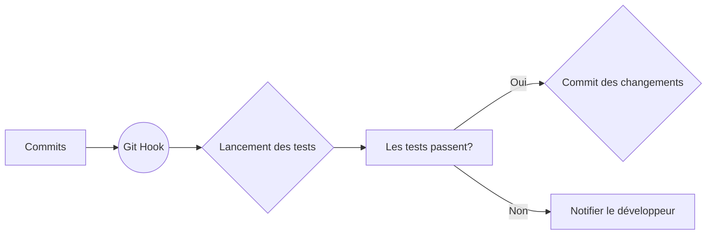
[🔝 Retour en haut de page](#table-des-matières)

